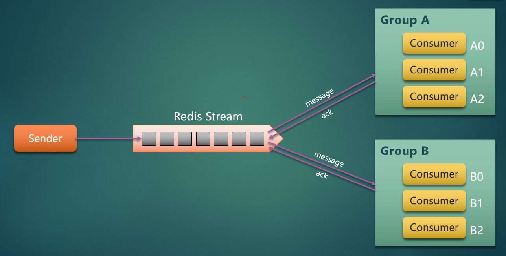

### 各种MQ的示例Demo



包括以下几种MQ 的常规使用方式

- **redis-mq**    
  `redis-mq` 包括简单的 `list` 方式实现 单服务多节点消费、多服务多节点消费、广播   
  以及 `redis 5` 提供的 `stream` 功能实现的 MQ 的示例。

- **rabbitmq**    
  
- **rocketmq**    

- **kafka**    

- **spring-cloud-stream 使用**    

---

本项目使用的 `springboot` 版本为 `2.2.6.RELEASE`   
   
在模块命令中
* `oson` 代表单服务单节点
* `mson` 代表多服务单节点
* `broadcasting` 代表广播

```!
 模块中的消息发送端都放在 `test` 目录下面的单元测试里面。
```